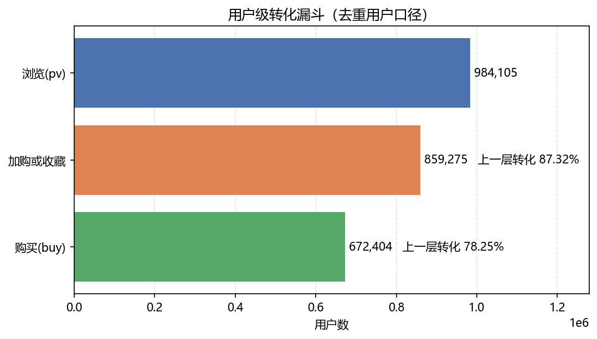
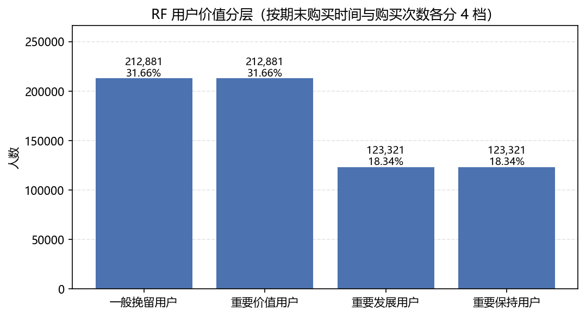
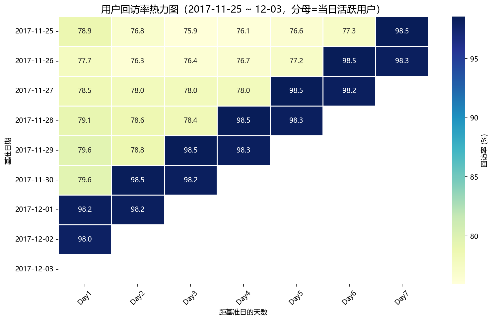
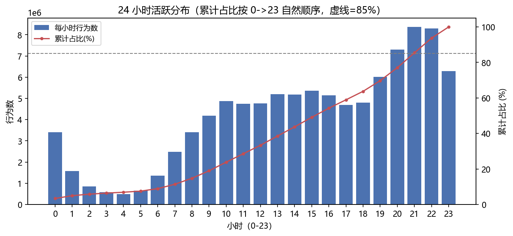
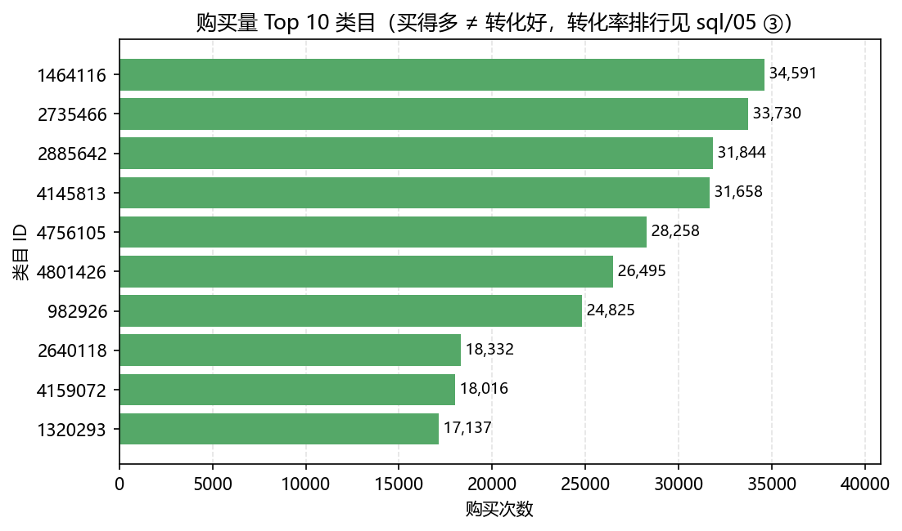

# 淘宝用户行为分析（SQL 版）

> **English summary.** An end-to-end analysis of the Alibaba Tianchi *User Behavior* dataset
> (100M rows over 9 days, 2017-11-25 ~ 12-03). All heavy metrics — user-level conversion funnel,
> retention, RF segmentation, cart-to-purchase lag — are computed in **MySQL 8.0** with CTEs and
> window functions; Python only reads the result CSVs and draws the charts.
> Headline results: **68.33%** user-level browse-to-purchase conversion; the largest drop-off is
> cart/fav → purchase (**21.75%** of those who carted or faved never purchased); and **71.68%** of
> cart-to-purchase conversions happen **more than one hour** after the item was added to the cart
> (40.61% after 24 hours).

---

> 基于阿里云天池「淘宝用户行为」数据集（1 亿行 / 9 天），回答电商运营的四个问题：
> **转化瓶颈在哪、哪些用户值得维护、用户回不回来、加购多久会转化**。
> 技术栈：**MySQL 8.0 做计算 + Python 只做取数和画图**。
>
> 三个主要结论：
> 1. 全站 987,991 个用户里有 672,404 人最终购买，**浏览到购买的用户转化率 68.33%**
>    （第一版用事件数相除得到的 32.94 是事件比、不是转化率，见 7.2 节）；
> 2. 加购是比收藏更强的购买信号：买过东西的用户里，加购次数是收藏次数的 **2.05 倍**；
> 3. 加购后真正成交的只有 **6.06%**，而且 **40.61%** 的成交发生在加购 24 小时之后——
>    召回不该只盯前几小时（见 7.6 节）。

---

## 1. 项目背景

用户从浏览到下单的决策过程藏在行为日志里。本项目从四个业务问题切入：

| 业务问题 | 分析方法 | 对应 SQL |
|---|---|---|
| 转化瓶颈在哪一环？ | 用户级转化漏斗 | `sql/05_funnel.sql` |
| 哪些用户值得重点维护？ | RF 用户价值分层 | `sql/07_rfm.sql` |
| 用户来得快、走得也快吗？ | 留存（回访率 + 新客留存两个口径） | `sql/06_retention.sql` |
| 加购后多久会下单？ | 加购到购买的时间间隔 | `sql/08_cart_to_buy.sql` |

---

## 2. 数据集

- **来源**：[阿里云天池 · 淘宝用户行为数据集](https://tianchi.aliyun.com/dataset/649)
- **时间范围**：2017-11-25 ~ 2017-12-03（含双十二预热期），共 9 天
- **规模**：**100,150,807 行**，约 3.6 GB
- **字段**：`user_id`、`item_id`、`category_id`、`behavior_type`、`ts`（秒级时间戳）
- **行为类型**：`pv` 浏览、`fav` 收藏、`cart` 加购、`buy` 购买
- **下载后放到**：项目根目录，文件名 `UserBehavior.csv`（3.6 GB，已在 `.gitignore` 中排除）

**已知数据问题**：原始 CSV 里有 **55,576 行落在标称时间窗口之外**（约占 0.055%）：
318 行 `ts` 为负数、52,830 行早于 2017-11-25（最远散到 182 天前）、
2,428 行晚于 2017-12-03（最远到 **2037-04-09**）。
其中负数那批最容易被忽略：`LOAD DATA` 遇到越界值不报错，而是「截断 + 警告」把负数写成 0，
而 `FROM_UNIXTIME(负数)` 又是 NULL，会把 `NOT NULL` 的 `dt` 列写坏。
所以 `sql/02_load_data.sql` 先用 `IF()` 把越界值压成 0，导入后**按窗口两头一起删**，
最终入库 **100,095,231 行**（= 100,150,807 - 55,576）。详见第 6 节。

> 数据集不含商品单价和订单金额，因此 RFM 中的 **M（Monetary）无法计算**，
> 本项目做的是 **RF 分层**。详见第 9 节「局限与反思」。

---

## 3. 技术栈：为什么把计算搬到 SQL

| 环节 | 工具 |
|---|---|
| 数据存储 | MySQL 8.0 |
| 清洗与指标计算 | SQL（CTE、窗口函数、自关联、`LOAD DATA`） |
| 取数与可视化 | Python、Pandas、Matplotlib、Seaborn |

第一版用 Pandas 直接读 CSV：1 亿行全量加载需要十几 GB 内存，且每改一个指标都要重跑全表。
本项目把「需要全表扫描的计算」交给 MySQL，Python 只负责取结果、画图和输出报告。

分工的判据是「要不要全表扫描」：

| 环节 | 放哪里 | 原因 |
|---|---|---|
| 全表聚合（漏斗、留存、RF、时间间隔） | **MySQL** | 建好索引后分钟级出结果，可复用、可对账 |
| 读取结果、画图、写报告 | Python | SQL 不适合做可视化 |
| 一次性探索、临时试算 | Python | 改一行不用重跑全表 |

---

## 4. 项目结构

```text
.
├── README.md
├── requirements.txt
├── UserBehavior.csv            # 原始数据（3.6 GB，不进版本库）
├── run_sql.py                  # 一条命令跑完 sql/ 下所有脚本，结果导出到 results/
├── preprocess.py               # 数据层：数据库连接 + 取数（原 pandas 预处理的位置）
├── funnel.py                   # 读 results/ 的漏斗结果，画 images/funnel.png
├── retention.py                # 读 results/ 的留存结果，两个口径
├── plot_retention.py           # 读 retention.py 的结果，画留存热力图
├── rfm.py                      # 读 results/ 的 RF 结果，画 images/rfm_segments.png
├── purchase_analysis.py        # 读 results/ 的复购/类目/小时结果，画两张图
├── import_to_mysql.py          # 备用：小批量导入（--date 只导一天 / --limit 只导 N 行）
├── scan_ts_anomalies.py        # 备用：扫描 ts 异常值
├── sql/
│   ├── 01_create_table.sql     # 建表
│   ├── 02_load_data.sql        # LOAD DATA 灌数据 + 清洗（替代 import_to_mysql.py 的全量导入）
│   ├── 03_create_indexes.sql   # 建索引（必须灌完数据再建）
│   ├── 04_data_quality.sql     # 数据质量核对（7 项）
│   ├── 05_funnel.sql           # 用户级漏斗 + 类目转化率
│   ├── 06_retention.sql        # 留存（口径 A 回访率 / 口径 B 新客留存）
│   ├── 07_rfm.sql              # RF 分层
│   ├── 08_cart_to_buy.sql      # 加购到购买的时间间隔
│   ├── 09_hourly.sql           # 小时分布 + 核心时段
│   └── 10_repurchase.sql       # 复购率 / 加购收藏比 / 付费用户偏好
├── results/                    # 每个 SQL 的结果 CSV（run_sql.py 自动生成）
└── images/                     # 图表（进版本库，保证 README 里的图不会失效）
```

---

## 5. 快速开始

### 5.1 环境要求

- MySQL 8.0（本项目在 8.0.46 上验证）
- Python 3.10+，安装依赖：

```bash
pip install -r requirements.txt
```

**磁盘空间**：1 亿行数据 + 3 个索引大约占 **12 GB**（实测表 5.0 GB、三个索引共 6.9 GB）。
如果系统盘空间不足，建议把 MySQL 的数据目录（`datadir`）搬到空间充足的盘，
并同时把 `tmpdir` 一起移过去——否则建索引时产生的临时文件仍会写进系统盘。
本项目把 datadir 放在 `E:\MySQL\Data`，改完 `my.ini` 后重启 MySQL 服务即可。

### 5.2 建库建表、灌数据、建索引（一条命令）

```bash
# 先在 MySQL 里建库
mysql -u root -p -e "CREATE DATABASE IF NOT EXISTS taobao DEFAULT CHARSET utf8mb4;"

# 改 preprocess.py 里的 DB_CONFIG（密码），然后：
python run_sql.py --all
```

`--all` 会依次执行 01 建表 → 02 `LOAD DATA` 灌 1 亿行 → 03 建索引。
实测耗时：`LOAD DATA` 灌满 100,150,807 行约 **4 分钟**，清洗 55,576 行窗口外数据约 35 秒，
建 3 个索引约 **5.4 分钟**（`02` 共 336 秒、`03` 共 324 秒）。
整条 `--all`（含 04~10 全部分析）在本机实测 **68.6 分钟**，全程每 30 秒有一次进度提示。

> 只想先跑通流程时，用 `python import_to_mysql.py --date 2017-11-25` 只导一天，
> 几分钟就能把「导入 → 分析 → 画图」整条链路走一遍。

### 5.3 跑分析、出结果

```bash
# 第 1 步：SQL 算，结果落盘到 results/*.csv（04~10 实测约 57 分钟）
python run_sql.py

# 第 2 步：读上面的 CSV 画图（几秒钟，不再重复扫 1 亿行）
python funnel.py            # images/funnel.png
python retention.py         # 整理出 results/retention_daily.csv、retention_cohort.csv
python plot_retention.py    # images/retention_heatmap.png
python rfm.py               # images/rfm_segments.png
python purchase_analysis.py # images/hourly_activity.png、images/top_categories.png
```

**这样分工的原因**：重活（全表扫描、聚合）只在 `run_sql.py` 里做一次，结果落成 CSV；
画图脚本只读那几十行结果，改配色、换图型、调字体都能秒级重跑，不必再扫一遍 1 亿行。
如果结果 CSV 不存在，画图脚本会提示先运行 `run_sql.py`。

每个 SQL 文件也能直接在 DBeaver / Navicat 里打开单跑，注释里写了每段的口径说明。

### 5.4 怎么运行这些 .py

**方式一：PyCharm 里点运行**（推荐，项目 SDK 选 `E:\anaconda3\envs\DETR`）

- 直接运行：打开文件 → 右上角绿色三角，或右键 → `Run 'xxx.py'`
- 需要参数的脚本（`run_sql.py`、`import_to_mysql.py`）：
  `Run` → `Edit Configurations` → 在 **Script parameters** 里填参数，
  例如 `--all`、`--only 03`、`--date 2017-11-25`。
  常用的可以存成多个配置：`run_sql (首次全量)` 填 `--all`，`run_sql (只跑分析)` 留空。
- 也可以直接用 PyCharm 底部的 **Terminal**，命令和命令行一致。

**方式二：命令行（PowerShell）**

```powershell
# 用完整路径指定解释器，避免用到系统里别的 Python
$py = "E:\anaconda3\envs\DETR\python.exe"
$p  = "E:\PycharmProjects\TaoBao-user-behavior-analysis"

& $py "$p\run_sql.py" --all     # 首次：建表 + 灌数据 + 建索引 + 全部分析
& $py "$p\run_sql.py"           # 之后：只跑分析，不重建表
& $py "$p\funnel.py"            # 画图
```

**每个脚本做什么、要不要参数、前置依赖、耗时**

| 脚本 | 作用 | 参数 | 前置依赖 | 耗时 |
|---|---|---|---|---|
| `run_sql.py` | 按顺序执行 `sql/` 下的脚本，结果导出到 `results/` | `--all` / `--only 05 06` / `--load` / `--dry-run` | MySQL 服务在运行 | 首次约 69 分钟；之后约 57 分钟；`--dry-run` 秒级 |
| `funnel.py` | 画漏斗图 | 无 | 先跑 `run_sql.py` | 秒级 |
| `retention.py` | 整理两个口径的留存率 | 无 | 同上 | 秒级 |
| `plot_retention.py` | 画留存热力图 | 无 | 同上 | 秒级 |
| `rfm.py` | 画 RF 分层图 | 无 | 同上 | 秒级 |
| `purchase_analysis.py` | 画小时分布、Top 类目 | 无 | 同上 | 秒级 |
| `preprocess.py` | 连库冒烟测试（打印行数和行为分布） | 无 | 数据已导入 | 秒级 |
| `import_to_mysql.py` | 备用：小批量导入（只导一天/N 行） | `--date 2017-11-25` / `--limit 1000000` | 表已建好 | 一天约几分钟 |
| `scan_ts_anomalies.py` | 备用：扫描原始 CSV 的时间戳异常 | 无 | 原始 CSV 在位 | 约 2 分钟 |

几点说明：

- **从哪个目录运行都可以**：脚本用 `Path(__file__)` 定位项目目录，不依赖当前工作目录。
- **`python xxx.py` 里的 `python` 必须是装了依赖的那个解释器**。双击 .py 文件时
  Windows 可能用系统里另一个 Python 打开，会因为缺 pandas / PyMySQL 报错；
  建议统一用上面的 `$py` 或 PyCharm 的 Run。
- **`run_sql.py` 默认跳过 01 / 02 / 03**（建表、灌数据、建索引都是破坏性或长耗时操作），
  需要重建时必须显式加 `--all`。这个默认值是刻意的：不加参数时不会误删已有数据。
- **改了 `sql/` 里的 SQL，要重跑 `run_sql.py` 再画图**，否则 `images/` 里还是旧结果。

---

## 6. 数据质量核对

执行 `python run_sql.py --only 04`，结果见 `results/04_data_quality__*.csv`：

| 检查项 | 结果 |
|---|---|
| 行为记录总数 | 100,095,231 |
| 去重用户数 | 987,991 |
| 商品数 / 类目数 | 4,161,138 / 9,437 |
| 时间覆盖范围 | 2017-11-25 00:00:00 ~ 2017-12-03 23:59:59 |
| 越界时间行数 | 0（55,576 行窗口外数据已在导入时剔除） |
| 重复行数（同用户+同商品+同行为+同一秒） | 49（占 0.00005%，未去重，见下方说明） |
| 空值 | 0（各列 `COUNT(*) - COUNT(col)` 均为 0） |

行为类型分布：

| 行为 | 次数 | 占比 |
|---|---|---|
| pv | 89,660,688 | 89.58% |
| cart | 5,530,446 | 5.53% |
| fav | 2,888,258 | 2.89% |
| buy | 2,015,839 | 2.01% |

每日行为量与活跃用户（`results/04_data_quality__03.csv`）：

| 日期 | 行为数 | 活跃用户 |
|---|---|---|
| 2017-11-25 | 10,420,015 | 706,641 |
| 2017-11-26 | 10,664,602 | 715,516 |
| 2017-11-27 | 10,101,147 | 710,094 |
| 2017-11-28 | 9,878,190 | 709,257 |
| 2017-11-29 | 10,284,073 | 718,922 |
| 2017-11-30 | 10,447,740 | 730,597 |
| 2017-12-01 | 10,859,436 | 740,139 |
| 2017-12-02 | 13,777,869 | **970,401** |
| 2017-12-03 | 13,662,159 | 966,977 |

> **关于那 49 行重复记录**：口径是「同一用户 + 同一商品 + 同一行为 + 同一秒」出现多次，
> 合计 49 行（占 0.00005%），属于同一秒内的重复点击，不构成数据质量问题。
> 本项目保留它们：用户级分析（漏斗、留存、RF）用的都是 `MAX(...)` 和 `COUNT(DISTINCT ...)`，
> 重复行不会改变结论；删掉反而会让"行为总数"和原始文件对不上，不利于对账。

> **窗口外数据的处理**：共 55,576 行，分三种情况——318 行 `ts` 为负
> （被 `LOAD DATA` 截断成 0）、52,830 行早于 11-25、2,428 行晚于 12-03。
> 处理方式：先在 `LOAD DATA` 的 `SET` 里用 `IF()` 把越界值压成 0
> （否则 `NOT NULL` 的 `dt` 会被写坏、整个导入直接失败），导入后按窗口两头一起删：
>
> ```sql
> DELETE FROM user_behavior
> WHERE dt <  '2017-11-25 00:00:00'
>    OR dt >= '2017-12-04 00:00:00';
> ```
>
> 没有选择直接改 CSV，是因为 3.6 GB 的文件改一遍要重新落盘，
> 而这条规则写在 SQL 里可复现、可审查。
>
> 一致性要求：**清洗条件（`02`）和校验条件（`04_data_quality.sql` 第 ⑦ 条）必须用同一套边界**。
> 本项目第一次实现时，`02` 只删了窗口左边、`04` 却检查了两边，结果出现"导入成功但行数对不上"——
> 这种不一致只能靠数据质量核对发现，所以 `04` 不是可选项。

---

## 7. 分析内容与结论

### 7.1 用户行为分布（用户级口径）

对每个用户，统计其在 9 天内是否产生过各类行为：

| 指标 | 用户数 | 占全站用户比例 |
|---|---|---|
| 浏览用户 | 984,105 | 99.61% |
| 加购用户 | 738,996 | 74.80% |
| 收藏用户 | 389,823 | 39.46% |
| 购买用户 | 672,404 | 68.06% |

产生过购买行为的用户中，加购次数是收藏次数的 **2.05 倍**
（加购 4,295,943 次 / 收藏 2,099,311 次，`sql/10_repurchase.sql` ②），
说明加购是比收藏更普遍的购买前动作。

### 7.2 转化漏斗（修正第一版的事件比口径）

收藏和加购是**并列行为**（可以只收藏不加购，也可以只加购不收藏），
所以漏斗是「浏览 → 加购或收藏 → 购买」，不是线性四步链。



| 环节 | 用户数 | 占浏览用户比例 | 相对上一层转化率 |
|---|---|---|---|
| 浏览(pv) | 984,105 | 100% | — |
| 加购或收藏 | 859,275 | 87.32% | 87.32% |
| 购买(buy) | 672,404 | 68.33% | 78.25% |

**结论**：流失最大的是「加购或收藏 → 购买」这一环——859,275 人加过购或收过藏，
最终只有 672,404 人下单，**流失 186,871 人（21.75%）**；而「浏览 → 加购或收藏」
只流失 12.68%。所以运营抓手应该在**加购/收藏之后的召回**，而不是前端的浏览转化。

> 口径提示：本数据集里 **68.33% 的浏览用户最终都买了**，远高于真实电商
> 2%~5% 的水平。这说明它是一份经过采样/筛选的日志（保留了以购买为主的行为），
> 所以这些数字只能用来比较**站内各环节之间的相对结构**，不能外推成"行业转化率"。

> **为什么要改口径**：第一版用 `df['behavior_type'].value_counts()` 得到
> 「全站转化比 32.94」，那是**行为事件数**之比——同一个用户点 30 次就算 30 次。
> 正确做法是先 `GROUP BY user_id` 把行为压成用户级标记再去重计数，
> 得到的才是「有多少人最终买了」，两者量级和含义完全不同。

### 7.3 RF 用户价值分层（不是 RFM）



| 用户分层 | 特征 | 人数 | 占比 |
|---|---|---|---|
| 重要价值用户 | 近期买过、买得频繁 | 212,881 | 31.66% |
| 重要保持用户 | 曾高频购买、但近期沉默 | 123,321 | 18.34% |
| 重要发展用户 | 近期买过、频次偏低 | 123,321 | 18.34% |
| 一般挽留用户 | 低频且近期沉默 | 212,881 | 31.66% |

分档口径：R（期末日期 − 最近一次购买日期）与 F（购买次数）各用 `NTILE(4)` 分 4 档，
`>= 3` 视为高，交叉成 2×2 四象限。`NTILE` 遇并列值会随机分配，
所以在 `ORDER BY` 里加了 `user_id` 做 tie-breaker，保证结果可复现。

**结论**：高价值两类（重要价值 + 重要保持）合计约 50%，
其中 **重要保持用户 123,321 人（18.34%）** 是最值得召回的一群：
他们平均买过 4.1 次、但最近已经有 4.0 天没下单（全站平均最近购买间隔只有 0.6 天）。
**重要发展用户 123,321 人（18.34%）** 最近买过但频次低（平均 1.4 次），
适合用推荐位和凑单提升购买频次。

> 分档方式的副作用：R 和 F 各用 `NTILE(4)` 分成两高两低，所以「高质量」和「低质量」
> 必然各占一半（这里正好各 336,202 人）。另外 R 与 F 高度正相关——买得多的人
> 通常最近也买过，所以两个混合象限人数完全相等（各 18.34%），这是 9 天窗口
> 压缩了「最近购买时间」区分度导致的，解读时不要过度解读象限差异。

> **为什么只做 RF**：数据集没有商品单价和订单金额，Monetary 无法构造。
> 强行用购买次数代替 M 会和 F 重复，所以本项目只做 RF——
> 第一版「文件名叫 RFM、函数叫 RF_analysis、README 写 RFM」的三处不一致，
> 在这里统一了。

### 7.4 留存分析（两个口径，结论不同）

两个口径的分母不同，**必须分开汇报**：

- **口径 A｜全站活跃用户回访率**：分母 = 当天所有活跃用户
- **口径 B｜新客留存（cohort）**：分母 = 当天首次出现的用户

口径 A（`results/retention_daily.csv`）：

| 基准日 | 基准活跃用户 | 次日回访率 | 七日回访率 |
|---|---|---|---|
| 2017-11-25 | 706,641 | 78.87% | 98.55% |
| 2017-11-26 | 715,516 | 77.73% | 98.27% |
| 2017-11-27 | 710,094 | 78.48% | 观测不完整 |
| 2017-11-28 | 709,257 | 79.13% | 观测不完整 |
| 2017-11-29 | 718,922 | 79.56% | 观测不完整 |
| 2017-11-30 | 730,597 | 79.63% | 观测不完整 |
| 2017-12-01 | 740,139 | 98.25% | 观测不完整 |
| 2017-12-02 | 970,401 | 97.98% | 观测不完整 |
| 2017-12-03 | 966,977 | — | — |

口径 B（`results/retention_cohort.csv`）：

| 首日 | 新增用户 | 次日留存率 | 七日留存率 |
|---|---|---|---|
| 2017-11-25 | 706,641 | 78.87% | 98.55% |
| 2017-11-26 | 158,188 | 65.38% | 97.35% |
| 2017-11-27 | 63,825 | 61.54% | 观测不完整 |
| 2017-11-28 | 31,331 | 61.81% | 观测不完整 |
| 2017-11-29 | 17,931 | 69.78% | 观测不完整 |
| 2017-11-30 | 9,801 | 94.61% | 观测不完整 |
| 2017-12-01 | 255 | 90.20% | 观测不完整 |
| 2017-12-02 | 18 | 72.22% | 观测不完整 |
| 2017-12-03 | 1 | — | — |



**结论**：真正可比的是 11-25 ~ 11-30 的次日回访率，稳定在 **78%~80%**。
12-01、12-02 突然跳到 98% 不是留存变好，而是**覆盖率造成的假高**：
12-02 的活跃用户有 970,401 人，占全站 987,991 的 **98.2%**（12-03 是 97.9%），
几乎覆盖了全部用户，所以任何"目标日落在 12-02 / 12-03"的留存率都会接近 98%
（比如 11-25 的 Day7 落在 12-02，就是 98.55%）。做留存分析时，
**必须先看目标日的用户覆盖率**，否则会把覆盖率当成留存。

新客口径（B）显示：11-25 进来的 706,641 人次日留存 78.87%；
之后每天的新增用户迅速衰减（158,188 → 63,825 → 31,331 → 17,931 → 9,801 →
255 → 18 → 1），次日留存也降到 61%~65%。也就是说这份日志的"新用户"
几乎都集中在第一天，后面几天的"新增"已经不是真正的新客了。

7 日留存率只有 11-25（98.55%）和 11-26（97.35%）观测完整，其余日期的观测窗口不足
（表中标注"观测不完整"），因此不能用这些数字说明"7 日留存很高"。

### 7.5 复购分析

复购率 **66.01%**（672,404 个购买用户中，443,858 人购买超过 1 次），
口径为「购买次数 > 1 次的用户」占「有过购买行为的用户」的比例
（`sql/10_repurchase.sql` ①）。

复购次数分布（`sql/10_repurchase.sql` ③）：

| 购买频次 | 人数 | 占比 |
|---|---|---|
| 只买过 1 次 | 228,546 | 33.99% |
| 买过 2 次 | 157,240 | 23.38% |
| 买过 3-5 次 | 204,795 | 30.46% |
| 买过 6 次以上 | 81,823 | 12.17% |

> **注意口径**：分母只包含有过购买的用户，不含只看不买的；且数据窗口只有 9 天，
> 又正好覆盖双十二预热期，集中促销会推高复购。
> 所以这个数字反映的是「已购用户的粘性」，不能外推成全站用户忠诚度。

### 7.6 加购到购买的转化时间

统计**同一用户对同一商品**从首次加购到首次购买的时间差
（数据集没有 `session_id`，无法还原真实会话路径，这是它的近似口径）：

| 时间窗口 | 商品对数 | 占比 |
|---|---|---|
| 10 分钟内 | 31,755 | 9.73% |
| 10 分钟 - 1 小时 | 35,199 | 10.78% |
| 1 - 6 小时 | 25,524 | 7.82% |
| 6 - 24 小时 | 101,436 | 31.07% |
| 超过 24 小时 | 132,590 | 40.61% |

总体：538.7 万个「用户-商品」加购组合中，有 32.7 万个最终成交，
加购到购买的整体转化率为 **6.06%**。

**结论**：第一版的结论是"加购后短时间窗口内转化更集中"，实测数据不支持这个说法：
1 小时内成交的只占 20.51%（9.73% + 10.78%），而 **24 小时之后成交的占 40.61%**，
6~24 小时占 31.07%——也就是说 **71.68% 的成交发生在加购 1 小时以后**。

因此加购召回的时间窗需要拉长：只做"1 小时内即时催付"会漏掉约七成成交。
更合理的节奏是 **1 小时 / 24 小时 / 72 小时三次触达**，把 24 小时之后的那 40.61% 一起覆盖。

> 第一版 README 写过「加购后短时间窗口内转化更集中」，但代码里没有任何计算时间间隔的逻辑。
> 现在 `sql/08_cart_to_buy.sql` 把它算了出来，结论以实测数据为准。

### 7.7 活跃时段



按 0→23 的自然顺序累计，占全天 **85%** 行为量的时段是 **0 点到 21 点**（累计 85.42%）
（`sql/09_hourly.sql` ②）。

其中晚间是绝对高峰：19 点 6.02%、20 点 7.30%、21 点 8.36%、22 点 8.29%、23 点 6.29%，
**19~23 点合计约 36.26%**。另外凌晨 0 点还有 3.40%，与早高峰 8 点的 3.40% 持平——
说明前一天的浏览会持续到次日零点，这部分流量容易被"按自然日切分"的报表漏掉。

> 第一版 `数据预处理.py` 先按热度降序排小时再算累计，得到的是一组「最热的小时」，
> 再把它们的 min/max 说成「从 X 点到 Y 点」——热门小时未必连续，这个结论不成立。
> 现已改为按自然顺序 0→23 累计。

### 7.8 品类偏好



购买量最高的类目是 **1464116**（34,591 次购买 / 29,953 个购买用户），
其后是 2735466（33,730 次）、2885642（31,844 次）（`sql/10_repurchase.sql` ④）。
但「买得多」不等于「转化好」，类目转化率排行见 `sql/05_funnel.sql` ③。

---

### 7.9 与第一版 pandas 结果的对账

第一版（pandas 脚本）与 SQL 版本的结果对比：

| 指标 | 第一版（pandas） | SQL 版本 | 是否一致 | 差异原因 |
|---|---|---|---|---|
| 行为记录总数 | — | 100,095,231 | — | 第一版没有落盘总数 |
| 复购率 | 65.81% | **66.01%** | 差 0.20pp | 口径相同（购买次数>1 / 有过购买）；差异来自第一版先 `drop_duplicates` 再去重统计 |
| 加购 / 收藏比 | 2.05 | **2.05** | 完全一致 | 口径相同，互相印证 |
| 购买 / 浏览（事件比） | 3.04% | **2.25%**（2,015,839 / 89,660,688） | 不一致 | 第一版那个数字来自更早的一次运行，样本口径已不可复现；以本次全量结果为准 |
| 浏览 → 购买（用户转化率） | 无（第一版算的是事件比 32.94） | **68.33%** | 口径变了 | 见 7.2 的说明：事件比不是转化率 |
| 重要价值用户占比 | 约 34% | **31.66%** | 近似 | 第一版用"大于平均分"，SQL 版用 `NTILE(4)` 的 `>=3`，并列值处理不同 |

结论：**加购/收藏比完全对上、复购率只差 0.2pp，说明迁移没有算错**；
变化大的两项（转化率、事件比）都是"口径变了"，不是"实现错了"。

---

## 8. 业务建议

- **召回优先盯加购未购买人群。** 加购是明确的购买意向信号，
  结合 7.6 的转化窗口：1 小时内成交只占 20.51%，24 小时内累计 59.40%，
  剩下 40.61% 发生在 24 小时之后。所以召回要做**多轮触达**（1 小时 / 24 小时 / 72 小时），
  不能只做即时催付。
- **高价值用户分开运营。** 重要保持用户曾高频购买但近期沉默，召回性价比最高；
  重要发展用户近期活跃但频次低，适合用推荐位提升购买频次。
- **转化瓶颈优先优化。** 流失最大的一环是「加购或收藏 → 购买」（21.75%），
  比「浏览 → 加购或收藏」（12.68%）更值得投入：优先做加购后的召回、凑单、
  以及"加购商品降价提醒"，而不是继续优化前端浏览转化。
- **投放对齐流量高峰。** 0 点到 21 点覆盖了 85% 的行为量，晚间 19~23 点是绝对高峰
  （21 点 8.36%、22 点 8.29%）；12 月 2 日的活跃用户数达到 **970,401**（全站覆盖率 98.2%），
  运营资源应向这些时点集中。

---

## 9. 局限与反思

1. **数据窗口只有 9 天。** 无法观察长期留存曲线和季节性，
   RF 分层里的「最近购买时间」被压缩在很短的区间内，区分度有限；
   末尾日期的 7 日留存率天然偏低（观测窗口不够），解读时必须说明。
2. **缺少金额字段。** RFM 退化为 RF，无法识别「高频但低客单价」这类群体。
3. **缺少曝光数据。** 只有点击之后的行为，没有曝光日志，
   因此算不出 CTR，也分不清「没点击」和「没看到」。
4. **没有 session_id。** 无法还原真实会话路径，7.6 的加购转化只能做到
   「同一用户 + 同一商品」的粒度，同一用户多次加购同一商品会被合并。
5. **行为日志不等于因果。** 复购率高不代表用户忠诚，
   也可能是大促集中投放导致的短期行为。
6. **用户与商品 ID 已脱敏。** 无法关联用户画像、类目名称和价格带，
   结论只能停在行为层面。
7. **原始数据存在脏数据。** 窗口外共 55,576 行（负数 318、偏早 52,830、偏晚 2,428），
   本项目按「剔除」处理：偏晚那批出现 2018~2037 年的日期，基本可以判定为时间戳损坏；
   如果这些行另有业务含义，更好的做法是回溯修正而不是删除。
8. **样本以已购用户为主。** 68.33% 的浏览用户最终购买，
   远高于真实电商 2%~5% 的水平，说明数据经过采样/筛选（保留了以购买为主的行为）。
   因此本项目所有比例（转化率、留存率、复购率）都只能用于**站内相对比较**，
   不能外推成行业水平。
9. **留存率会被覆盖率放大。** 12-02 / 12-03 两天的活跃用户占全站 98% 以上，
   任何以这两天为观测终点的留存率都会接近 98%。因此看留存必须先确认
   目标日的用户覆盖率，否则会把「覆盖率」误读成「留存好」。

---

## 10. 后续计划

- [ ] 补充 2017-11-25 之前的历史数据，把留存观测窗口拉长到 30 天以上
- [ ] 引入商品价格数据，把 RF 扩展为完整的 RFM
- [ ] 用马尔可夫链或路径分析还原用户行为序列，替代用户级漏斗
- [ ] 对高价值用户做购买间隔分布分析，估计用户生命周期价值

---

## 参考资料

- 数据集：[阿里云天池 · 用户行为数据集](https://tianchi.aliyun.com/dataset/649)

---

## License

- **代码**：[MIT](LICENSE)，可自由用于学习与二次开发，保留版权声明即可。
- **数据**：版权归阿里云天池所有，本项目不随仓库分发原始 CSV，
  使用时请遵循[数据集页面的使用条款](https://tianchi.aliyun.com/dataset/649)。
